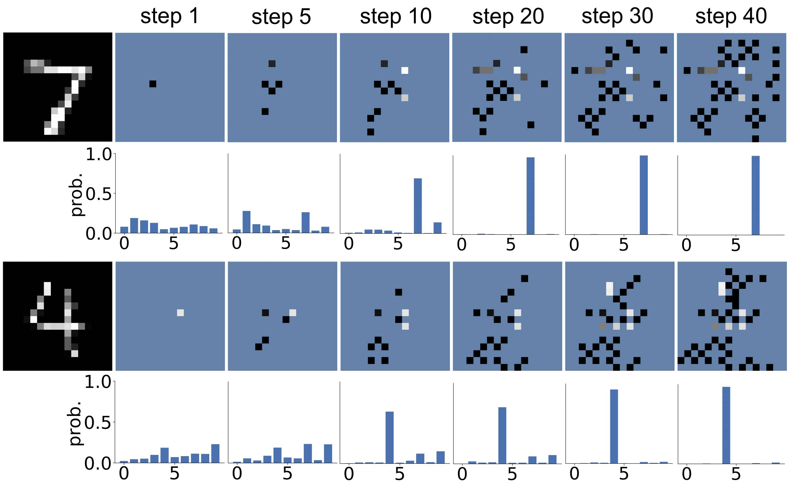

# Dynamic Feature Acquisition with Arbitrary Conditional Flows

> This is the official repository for `ACFlow-DFA`. Please see our paper for technical details.

> Our method dynamically acquires new features to improve the predictions.



## prerequisites
clone our repository
```
git clone
```

install required packages (virtual environment is preferred)
```
pip install -r requirements.txt
```

## Prepare datasets
see `data` folder for code to preprocess all datasets we used. We cannot provide the original data due to the copyright issues. Please download from the corresponding repository (links are given in the comments.)

## Experiments

### Classification
- for `synthetic` dataset
```
(Train) python scripts/train.py --cfg_file=./exp/syn/params.json
(ACFlow DFA) python scripts/test_cls_dfa.py --cfg_file=./exp/syn/params.json
(ACFlow SFA) python scripts/test_cls_sfa.py --cfg_file=./exp/syn/params.json
```
- for `gas` dataset
```
(Train) python scripts/train.py --cfg_file=./exp/gas/params.json
(ACFlow DFA) python scripts/test_cls_dfa.py --cfg_file=./exp/gas/params.json
(ACFlow SFA) python scripts/test_cls_sfa.py --cfg_file=./exp/gas/params.json
```

### Regression
- for `housing` dataset
```
(Train) python scripts/train.py --cfg_file=./exp/housing/params.json
(ACFlow DFA) python scripts/test_reg_dfa.py --cfg_file=./exp/housing/params.json
(ACFlow SFA) python scripts/test_reg_sfa.py --cfg_file=./exp/housing/params.json
```
- for `whitewine` dataset
```
(Train) python scripts/train.py --cfg_file=./exp/whitewine/params.json
(ACFlow DFA) python scripts/test_reg_dfa.py --cfg_file=./exp/whitewine/params.json
(ACFlow SFA) python scripts/test_reg_sfa.py --cfg_file=./exp/whitewine/params.json
```

### Bayesian Network
- for synthetic datasets from Bayesian network repository (`asia` and `sachs`)
```
(Train) python scripts/train.py --cfg_file=./exp/asia/params.json
(ACFlow DFA) python scripts/test_reg_dfa.py --cfg_file=./exp/asia/params.json
(BN Learn) python scripts/bn_learn.py --cfg_file=./ep/asia/params.json
(BN:ACFlow) python scripts/test_bn_dfa.py --cfg_file=./exp/asia/params.json --gfile=./exp/asia/bn_learn/results.pkl
(BN:GT) python scripts/test_bn_dfa.py --cfg_file=./exp/asia/params.json --gfile=./data/asia/asia_bn_0.3.pkl
```
```
(Train) python scripts/train.py --cfg_file=./exp/sachs/params.json
(ACFlow DFA) python scripts/test_reg_dfa.py --cfg_file=./exp/sachs/params.json
(BN Learn) python scripts/bn_learn.py --cfg_file=./ep/sachs/params.json
(BN:ACFlow) python scripts/test_bn_dfa.py --cfg_file=./exp/sachs/params.json --gfile=./exp/sachs/bn_learn/results.pkl
(BN:GT) python scripts/test_bn_dfa.py --cfg_file=./exp/sachs/params.json --gfile=./data/sachs/sachs_bn_0.3.pkl
```
- for UCI datasets (`boston housing` and `whitewine`)
```
(BN Learn) python scripts/bn_learn.py --cfg_file=./exp/housing/params.json
(BN:ACFlow) python scripts/test_bn_dfa.py --cfg_file=./exp/housing/params.json --gfile=./exp/housing/bn_learn/results.pkl
```
```
(BN Learn) python scripts/bn_learn.py --cfg_file=./exp/whitewine/params.json
(BN:ACFlow) python scripts/test_bn_dfa.py --cfg_file=./exp/whitewine/params.json --gfile=./exp/whitewine/bn_learn/results.pkl
```

### Time Series
- for `digits` dataset
```
(Train) python scripts/train.py --cfg_file=./exp/digits/params.json
(ACFlow DFA) python scripts/test_ts_dfa.py --cfg_file=./exp/digits/params.json
(Valid Prob.) python scripts/test_ts_prob.py --cfg_file=./exp/digits/params.json --split=valid
(Test Prob.) python scripts/test_ts_prob.py --cfg_file=./exp/digits/params.json --split=test
(Calibration) python scripts/calibrate.py --cfg_file=./exp/digits/params.json
```
- for `pedestrian` dataset
```
(Train) python scripts/train.py --cfg_file=./exp/pedestrian/params.json
(ACFlow DFA) python scripts/test_ts_dfa.py --cfg_file=./exp/pedestrian/params.json
(Valid Prob.) python scripts/test_ts_prob.py --cfg_file=./exp/pedestrian/params.json --split=valid
(Test Prob.) python scripts/test_ts_prob.py --cfg_file=./exp/pedestrian/params.json --split=test
(Calibration) python scripts/calibrate.py --cfg_file=./exp/pedestrian/params.json
```

## Reference

